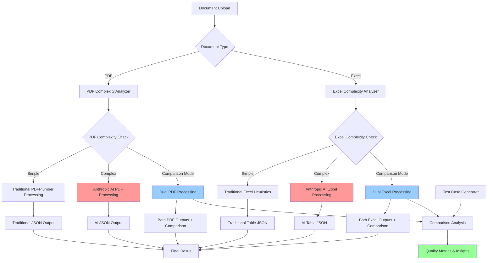
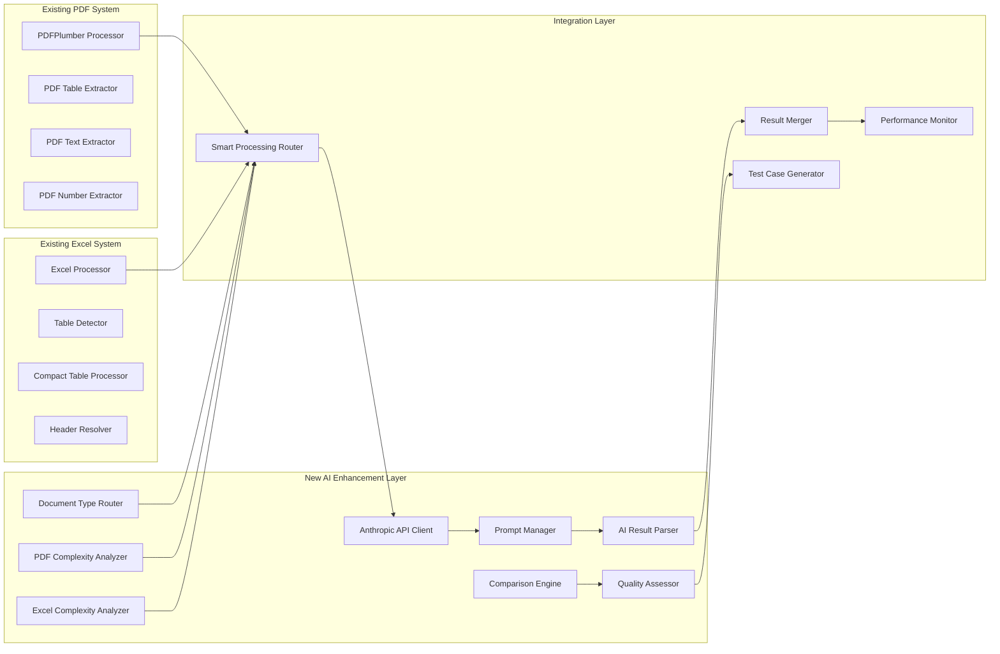

# Anthropic AI Enhancement Design
## PDF & Excel Processing with AI-Powered Extraction and Complexity Failover

**Version:** 2.0  
**Date:** January 2025  
**Status:** Design Phase - Expanded for Excel  

---

## 📋 Executive Summary

This document outlines the design and implementation plan for enhancing both PDF and Excel extraction systems with Anthropic AI capabilities. The enhancement will add AI-powered extraction as both a comparison tool for improving traditional techniques and as a smart failover mechanism for complex documents.

### Expanded Scope
- **PDF Processing**: Original focus on AI-powered extraction for complex documents
- **Excel Processing**: New addition focusing on complex table detection and structure analysis

### Key Objectives
1. **Comparison Dataset Generation**: Use Anthropic AI to extract text, numbers, and tables to create robust test cases
2. **Complexity-Based Failover**: Automatically detect complex documents and use Anthropic AI when traditional methods struggle
3. **Quality Improvement**: Leverage AI extraction results to enhance traditional coding techniques
4. **Seamless Integration**: Maintain existing API compatibility while adding new AI capabilities

---

## 🔍 Excel Table Detection Complexity Analysis

### Current Heuristic Success Patterns

Based on analysis of the existing table detection system (`TableDetector` and `CompactTableProcessor`), the current heuristics succeed in these scenarios:

#### ✅ **High Success Scenarios (Traditional Heuristics Work Well)**

1. **Frozen Panes Tables**
   - **Success Rate**: ~95%
   - **Characteristics**: Clear header delineation via frozen rows/columns
   - **Example**: Financial dashboards with frozen first row and column
   - **Detection Method**: `_detect_by_frozen_panes` - highest priority method

2. **Simple Financial Statements**
   - **Success Rate**: ~90%
   - **Characteristics**: 
     - Section headers in first column only ("Assets", "Liabilities")
     - Consistent column structure across data rows
     - Clear temporal headers (dates, periods)
   - **Detection Method**: `_detect_financial_statement_layout`

3. **Clean Separated Tables**
   - **Success Rate**: ~85%
   - **Characteristics**: 
     - Tables separated by 2+ blank rows
     - Consistent row/column boundaries
     - Uniform data types within columns
   - **Detection Method**: `_detect_by_blank_row_separation`

4. **Temporal Data Tables**
   - **Success Rate**: ~80%
   - **Characteristics**:
     - Date sequences in headers (2024-01-01, 2024-02-01)
     - Month patterns (Month 1, Month 2)
     - Time-series data structure
   - **Detection Method**: `_detect_by_temporal_headers`

#### ⚠️ **Moderate Success Scenarios (Heuristics Struggle)**

1. **Multi-Level Headers**
   - **Success Rate**: ~60%
   - **Failure Cases**:
     - Complex hierarchy (3+ header levels)
     - Merged cells spanning multiple columns/rows
     - Inconsistent header patterns across levels
   - **Example**: `test_complex_table.py` - Q1/Q2 with Jan/Feb/Apr/May subheaders

2. **Embedded Section Headers**
   - **Success Rate**: ~55%
   - **Failure Cases**:
     - Section headers mixed within data rows
     - Headers that span partial columns
     - Section headers that don't follow financial patterns
   - **Memory Reference**: [[memory:5504365]] - 360 Energy file with complex sections

3. **Irregular Table Boundaries**
   - **Success Rate**: ~50%
   - **Failure Cases**:
     - Tables with inconsistent column counts
     - Data that doesn't align to clear grid patterns
     - Mixed content types (formulas, text, numbers) in unexpected patterns

#### ❌ **High Failure Scenarios (AI Fallback Needed)**

1. **Complex Merged Cell Structures**
   - **Success Rate**: <30%
   - **Failure Cases**:
     - Extensive cell merging across multiple dimensions
     - Merged cells that break normal table grid assumptions
     - Headers that span non-contiguous areas

2. **Non-Standard Table Layouts**
   - **Success Rate**: <25%
   - **Failure Cases**:
     - Tables with mixed orientations
     - Nested table structures
     - Tables where headers are not in first row/column
     - Cross-tabulation with complex grouping

3. **Sparse Data with Complex Patterns**
   - **Success Rate**: <20%
   - **Failure Cases**:
     - Large amounts of empty space creating false boundaries
     - Data clusters that don't follow row/column alignment
     - Multiple independent data regions on same sheet
   - **Memory Reference**: [[memory:5504365]] - Empty trailing areas problem

4. **Dynamic Formula-Heavy Tables**
   - **Success Rate**: <15%
   - **Failure Cases**:
     - Tables where structure is determined by formulas
     - Conditional formatting that affects table boundaries
     - Dynamic ranges that change based on data

### Excel Complexity Scoring Criteria

Based on the analysis above, here are the specific metrics for determining when to use AI fallback:

#### **Complexity Score Calculation (0.0 - 1.0)**

```python
def calculate_excel_complexity_score(sheet_data):
    score = 0.0
    
    # Merged Cell Complexity (0.0 - 0.3)
    merged_cells = len(sheet_data.get('merged_cells', []))
    total_cells = estimate_total_data_cells(sheet_data)
    merge_ratio = merged_cells / max(total_cells, 1)
    score += min(merge_ratio * 3, 0.3)  # Cap at 0.3
    
    # Multi-Level Header Complexity (0.0 - 0.25)
    header_levels = detect_header_levels(sheet_data)
    if header_levels > 2:
        score += min((header_levels - 2) * 0.1, 0.25)
    
    # Data Sparsity Complexity (0.0 - 0.2)
    sparsity_ratio = calculate_sparsity_ratio(sheet_data)
    if sparsity_ratio > 0.5:  # More than 50% empty
        score += min((sparsity_ratio - 0.5) * 0.4, 0.2)
    
    # Column Structure Inconsistency (0.0 - 0.15)
    inconsistency = analyze_column_inconsistency(sheet_data)
    score += min(inconsistency, 0.15)
    
    # Formula Complexity (0.0 - 0.1)
    formula_complexity = analyze_formula_patterns(sheet_data)
    score += min(formula_complexity, 0.1)
    
    return min(score, 1.0)
```

#### **AI Fallback Thresholds**

- **score < 0.3**: Traditional heuristics only
- **0.3 ≤ score < 0.7**: Dual processing (traditional + AI comparison)
- **score ≥ 0.7**: AI-first with traditional backup

---

## 🏗️ System Architecture

### High-Level Architecture



### Component Architecture



---

## 🧠 Core Components Design

### 1. Excel Complexity Analyzer (`excel_complexity_analyzer.py`)

**Purpose**: Determine Excel sheet complexity to decide between traditional heuristics and AI processing

**Excel-Specific Complexity Metrics:**
- **Merged Cell Complexity**: Ratio of merged cells to total data cells
- **Header Hierarchy Complexity**: Number of header levels, inconsistent patterns
- **Data Sparsity**: Empty cell ratio, scattered data patterns
- **Column Structure Consistency**: Variance in column data types and patterns
- **Formula Complexity**: Complex formula dependencies, dynamic ranges
- **Table Boundary Ambiguity**: Unclear table separation, overlapping regions

**Implementation:**
```python
class ExcelComplexityAnalyzer:
    def __init__(self, thresholds=None):
        self.thresholds = thresholds or self._default_excel_thresholds()
    
    def analyze_sheet_complexity(self, sheet_data):
        """Analyze Excel sheet complexity and return complexity score"""
        metrics = {
            'merged_cell_complexity': self._analyze_merged_cells(sheet_data),
            'header_complexity': self._analyze_header_structure(sheet_data),
            'sparsity_complexity': self._analyze_data_sparsity(sheet_data),
            'column_inconsistency': self._analyze_column_structure(sheet_data),
            'formula_complexity': self._analyze_formula_patterns(sheet_data),
            'boundary_ambiguity': self._analyze_table_boundaries(sheet_data)
        }
        
        overall_score = self._calculate_excel_complexity_score(metrics)
        
        return {
            'complexity_score': overall_score,
            'complexity_level': self._get_complexity_level(overall_score),
            'metrics': metrics,
            'recommendation': self._get_excel_processing_recommendation(overall_score),
            'failure_indicators': self._identify_failure_indicators(metrics)
        }
    
    def _analyze_merged_cells(self, sheet_data):
        """Analyze complexity from merged cell patterns"""
        merged_cells = sheet_data.get('merged_cells', [])
        total_data_cells = self._estimate_data_cell_count(sheet_data)
        
        if total_data_cells == 0:
            return 0.0
        
        merge_ratio = len(merged_cells) / total_data_cells
        
        # Check for complex merge patterns
        complex_merges = 0
        for merge in merged_cells:
            rows_spanned = merge['end_row'] - merge['start_row'] + 1
            cols_spanned = merge['end_column'] - merge['start_column'] + 1
            if rows_spanned > 2 or cols_spanned > 2:
                complex_merges += 1
        
        complexity_score = merge_ratio
        if complex_merges > 0:
            complexity_score += (complex_merges / len(merged_cells)) * 0.5
        
        return min(complexity_score, 1.0)
    
    def _analyze_header_structure(self, sheet_data):
        """Analyze multi-level header complexity"""
        cells = sheet_data.get('cells', {})
        dimensions = sheet_data.get('dimensions', {})
        
        # Detect header levels by analyzing first few rows
        max_row_to_check = min(dimensions.get('max_row', 10), 10)
        header_levels = self._detect_header_levels(cells, max_row_to_check)
        
        # Check for header inconsistencies
        inconsistencies = self._detect_header_inconsistencies(cells, header_levels)
        
        complexity = 0.0
        if header_levels > 2:
            complexity += (header_levels - 2) * 0.2
        
        complexity += inconsistencies * 0.3
        
        return min(complexity, 1.0)
```

### 2. Document Type Router (`document_type_router.py`)

**Purpose**: Route documents to appropriate processing pipelines based on file type and content analysis

**Excel-Specific Features:**
- Sheet-level complexity analysis
- Processing recommendation per sheet
- Integration with existing Excel processors

**Implementation:**
```python
class DocumentTypeRouter:
    def __init__(self):
        self.pdf_analyzer = PDFComplexityAnalyzer()
        self.excel_analyzer = ExcelComplexityAnalyzer()
    
    def route_document(self, file_path, document_data=None):
        """Route document to appropriate processing pipeline"""
        file_extension = os.path.splitext(file_path)[1].lower()
        
        if file_extension == '.pdf':
            return self._route_pdf(file_path)
        elif file_extension in ['.xlsx', '.xlsm', '.xltx', '.xltm']:
            return self._route_excel(file_path, document_data)
        else:
            raise ValueError(f"Unsupported file type: {file_extension}")
    
    def _route_excel(self, file_path, document_data):
        """Route Excel file based on complexity analysis"""
        if document_data is None:
            # Load Excel data for analysis
            processor = ExcelProcessor()
            document_data = processor.process_file(file_path)
        
        routing_decisions = []
        
        for sheet in document_data['workbook']['sheets']:
            analysis = self.excel_analyzer.analyze_sheet_complexity(sheet)
            
            routing_decisions.append({
                'sheet_name': sheet['name'],
                'complexity_score': analysis['complexity_score'],
                'complexity_level': analysis['complexity_level'],
                'recommendation': analysis['recommendation'],
                'processing_method': self._determine_excel_processing_method(analysis),
                'failure_indicators': analysis['failure_indicators']
            })
        
        return {
            'document_type': 'excel',
            'file_path': file_path,
            'routing_decisions': routing_decisions,
            'overall_recommendation': self._get_overall_excel_recommendation(routing_decisions)
        }
```

### 3. Enhanced Anthropic API Client (`anthropic_client.py`)

**Purpose**: Handle all interactions with Anthropic's API including file uploads and structured prompting

**Enhanced Features:**
- File upload management for PDF and Excel
- Document-type specific prompt templates
- Response parsing and validation
- Error handling and retry logic
- Rate limiting and quota management

**Implementation:**
```python
class AnthropicClient:
    def __init__(self, api_key, model="claude-3-5-sonnet-20241022"):
        self.client = anthropic.Anthropic(api_key=api_key)
        self.model = model
        
    def extract_pdf_content(self, pdf_path, extraction_type="comprehensive"):
        """Extract content from PDF using Anthropic AI"""
        prompt = self._build_pdf_extraction_prompt(extraction_type)
        
        try:
            response = self.client.beta.messages.create(
                model=self.model,
                max_tokens=8192,
                messages=[{
                    "role": "user",
                    "content": [
                        {"type": "document", "source": {"type": "base64", "media_type": "application/pdf", "data": self._encode_pdf(pdf_path)}},
                        {"type": "text", "text": prompt}
                    ]
                }]
            )
            
            return self._parse_ai_response(response.content[0].text)
            
        except Exception as e:
            raise AnthropicProcessingError(f"AI extraction failed: {str(e)}")
    
    def analyze_excel_tables(self, excel_data, sheet_name, complexity_info):
        """Analyze Excel table structure using Anthropic AI"""
        prompt = self._build_excel_analysis_prompt(complexity_info)
        
        try:
            # Convert Excel data to a text representation for AI analysis
            excel_text = self._excel_to_text_representation(excel_data, sheet_name)
            
            response = self.client.messages.create(
                model=self.model,
                max_tokens=8192,
                messages=[{
                    "role": "user",
                    "content": prompt + "\n\nExcel Data:\n" + excel_text
                }]
            )
            
            return self._parse_excel_analysis_response(response.content[0].text)
            
        except Exception as e:
            raise AnthropicProcessingError(f"AI Excel analysis failed: {str(e)}")
```

### 4. Enhanced Prompt Manager (`prompt_manager.py`)

**Purpose**: Manage AI prompts for different extraction scenarios with JSON schema integration

**Expanded Prompt Categories:**

**PDF Prompts:**
- **Comprehensive PDF Extraction**: Full document analysis with tables, text, and numbers
- **PDF Table-Focused Extraction**: Specialized for complex table structures
- **PDF Text-Focused Extraction**: Optimized for text and number extraction

**Excel Prompts:**
- **Excel Table Structure Analysis**: Specialized for complex table detection
- **Excel Header Hierarchy Analysis**: Multi-level header structure detection
- **Excel Data Region Identification**: Finding meaningful data boundaries
- **Excel Merged Cell Analysis**: Understanding complex merge patterns

**Cross-Document Prompts:**
- **Comparison Extraction**: Structured for test case generation
- **Quality Assessment**: Evaluating extraction accuracy

**Implementation:**
```python
class PromptManager:
    def __init__(self, schema_manager):
        self.schema_manager = schema_manager
        self.pdf_prompts = self._load_pdf_prompt_templates()
        self.excel_prompts = self._load_excel_prompt_templates()
    
    def build_excel_analysis_prompt(self, complexity_info, analysis_type="table_structure"):
        """Build Excel-specific analysis prompt"""
        base_prompt = self.excel_prompts[analysis_type]
        schema = self.schema_manager.get_excel_schema(analysis_type)
        
        complexity_context = self._build_complexity_context(complexity_info)
        
        return f"""
{base_prompt}

COMPLEXITY ANALYSIS CONTEXT:
{complexity_context}

IMPORTANT: You must return your response as valid JSON following this exact schema:

{json.dumps(schema, indent=2)}

Please analyze the Excel data structure and focus on:

1. **Table Detection**: Identify all distinct table regions within the sheet
2. **Header Structure**: Detect multi-level headers and their hierarchy
3. **Data Boundaries**: Determine clear table boundaries despite merged cells or sparse data
4. **Row/Column Relationships**: Understand header-to-data relationships
5. **Quality Assessment**: Provide confidence scores for detected structures

Pay special attention to the complexity indicators identified:
{self._format_failure_indicators(complexity_info.get('failure_indicators', []))}

Return only the JSON response without any additional commentary.
"""
    
    def build_pdf_extraction_prompt(self, extraction_type, document_context=None):
        """Build PDF-specific extraction prompt"""
        base_prompt = self.pdf_prompts[extraction_type]
        schema = self.schema_manager.get_pdf_schema(extraction_type)
        
        return f"""
{base_prompt}

IMPORTANT: You must return your response as valid JSON following this exact schema:

{json.dumps(schema, indent=2)}

Please extract all relevant information from the PDF document and structure it according to this schema. Pay special attention to:

1. **Tables**: Extract all tabular data with proper row/column structure
2. **Numbers**: Identify all numerical values with their context and formatting
3. **Text**: Organize text content into logical sections with metadata
4. **Positioning**: Include spatial information where possible
5. **Quality**: Provide confidence scores for extracted data

Return only the JSON response without any additional commentary.
"""
    
    def _build_complexity_context(self, complexity_info):
        """Build context string from complexity analysis"""
        score = complexity_info.get('complexity_score', 0)
        level = complexity_info.get('complexity_level', 'unknown')
        
        context = f"Complexity Score: {score:.2f} ({level})\n"
        
        metrics = complexity_info.get('metrics', {})
        for metric_name, metric_value in metrics.items():
            context += f"- {metric_name}: {metric_value:.3f}\n"
        
        return context
```
```

### 5. Enhanced AI Result Parser (`ai_result_parser.py`)

**Purpose**: Parse and validate AI responses, converting them to system-compatible format

**Enhanced Features:**
- JSON validation against PDF and Excel schemas
- Error handling for malformed responses
- Data type conversion and normalization
- Confidence score extraction
- Metadata enhancement
- Excel-specific structure validation

**Excel-Specific Parsing:**
```python
class AIResultParser:
    def parse_excel_analysis_response(self, ai_response):
        """Parse AI response for Excel table analysis"""
        try:
            parsed_data = json.loads(ai_response)
            
            # Validate against Excel analysis schema
            self._validate_excel_schema(parsed_data)
            
            # Convert to system-compatible format
            return {
                'detected_tables': self._normalize_detected_tables(parsed_data.get('tables', [])),
                'header_analysis': self._normalize_header_analysis(parsed_data.get('headers', {})),
                'complexity_assessment': parsed_data.get('complexity_assessment', {}),
                'confidence_scores': parsed_data.get('confidence_scores', {}),
                'processing_metadata': {
                    'ai_model': parsed_data.get('metadata', {}).get('model', 'unknown'),
                    'processing_time': parsed_data.get('metadata', {}).get('processing_time', 0),
                    'confidence_overall': parsed_data.get('metadata', {}).get('confidence', 0.5)
                }
            }
        except json.JSONDecodeError as e:
            raise AIParsingError(f"Invalid JSON response: {str(e)}")
        except Exception as e:
            raise AIParsingError(f"Failed to parse Excel analysis: {str(e)}")
```

### 6. Enhanced Comparison Engine (`comparison_engine.py`)

**Purpose**: Compare traditional and AI extraction results to generate insights and test cases

**Enhanced Comparison Metrics:**

**PDF Comparison:**
- **Accuracy**: Correctness of extracted data
- **Completeness**: Coverage of all content
- **Structure**: Quality of data organization
- **Performance**: Processing time and resource usage

**Excel Comparison:**
- **Table Detection Accuracy**: Correct identification of table boundaries
- **Header Structure Accuracy**: Proper multi-level header detection
- **Data Relationship Accuracy**: Correct row/column label associations
- **Merged Cell Handling**: Effectiveness with complex merged structures
- **Processing Efficiency**: Speed and resource usage comparison

---

## 📊 Data Schemas and Integration

### Enhanced PDF Processing Result Schema

```json
{
  "pdf_processing_result": {
    "document_metadata": {
      "filename": "string",
      "total_pages": "number",
      "processing_timestamp": "string (ISO 8601)",
      "processing_duration": "number (seconds)",
      "complexity_analysis": {
        "complexity_score": "number (0.0-1.0)",
        "complexity_level": "simple|moderate|complex|extreme",
        "metrics": {
          "table_complexity": "number",
          "layout_complexity": "number", 
          "content_density": "number",
          "extraction_difficulty": "number"
        },
        "recommendation": "traditional|ai|dual"
      },
      "processing_method": "traditional|ai|dual",
      "extraction_methods": ["traditional", "ai"]
    },
    "traditional_result": {
      // Existing PDFPlumber result structure
    },
    "ai_result": {
      "extraction_metadata": {
        "model_used": "string",
        "processing_time": "number",
        "confidence_score": "number (0.0-1.0)",
        "api_usage": {
          "tokens_used": "number",
          "cost_estimate": "number"
        }
      },
      "extracted_content": {
        // AI-extracted content in same format as traditional
      }
    },
    "comparison_analysis": {
      "accuracy_score": "number (0.0-1.0)",
      "completeness_score": "number (0.0-1.0)",
      "quality_metrics": {
        "table_extraction_accuracy": "number",
        "number_extraction_accuracy": "number",
        "text_extraction_quality": "number"
      },
      "differences": {
        "tables_found": {
          "traditional": "number",
          "ai": "number"
        },
        "numbers_found": {
          "traditional": "number", 
          "ai": "number"
        },
        "content_differences": ["string"]
      }
    },
    "final_result": {
      // Best combined result or single method result
    }
  }
}
```

### Test Case Generation Schema

```json
{
  "test_case": {
    "test_id": "string",
    "generated_timestamp": "string (ISO 8601)",
    "source_document": {
      "filename": "string",
      "complexity_level": "string",
      "characteristics": ["string"]
    },
    "ground_truth": {
      "method": "ai|manual|consensus",
      "confidence": "number (0.0-1.0)",
      "validated_by": "string",
      "validation_date": "string (ISO 8601)"
    },
    "test_scenarios": [
      {
        "scenario_name": "string",
        "input_parameters": {},
        "expected_output": {},
        "success_criteria": {
          "min_accuracy": "number",
          "min_completeness": "number",
          "max_processing_time": "number"
        }
      }
    ],
    "performance_benchmarks": {
      "traditional_method": {
        "processing_time": "number",
        "accuracy": "number",
        "completeness": "number"
      },
      "ai_method": {
        "processing_time": "number", 
        "accuracy": "number",
        "completeness": "number"
      }
    }
  }
}
```

---

## 🔧 Implementation Plan

### Phase 1: Excel Complexity Analysis Foundation (Weeks 1-2)

#### Week 1: Excel Complexity Infrastructure
1. **Excel Complexity Analyzer Development**
   - Implement merged cell complexity analysis
   - Create header structure detection algorithms
   - Add data sparsity analysis
   - Develop column structure consistency metrics
   - Test with 360 Energy file [[memory:5504365]]

2. **Integration with Existing Excel System**
   - Extend `TableDetector` with complexity scoring
   - Enhance `CompactTableProcessor` with AI fallback hooks
   - Create Excel-specific complexity thresholds
   - Test with complex table scenarios from `test_complex_table.py`

3. **Excel-Specific Prompt Development**
   - Create Excel table structure analysis prompts
   - Design header hierarchy analysis prompts
   - Develop merged cell analysis prompts
   - Test prompts with complex Excel structures

#### Week 2: Excel AI Integration Pipeline
1. **Excel AI Result Parser**
   - Create Excel-specific JSON validation and parsing
   - Implement error handling for table analysis
   - Add Excel data type conversion
   - Create table structure normalization

2. **Excel Smart Router**
   - Implement Excel processing decision logic based on complexity
   - Create Excel-specific fallback mechanisms
   - Add sheet-level configuration options
   - Integrate with existing `CompactTableProcessor`

3. **Excel Initial Testing**
   - Test AI table detection on complex Excel files
   - Validate Excel analysis prompt responses
   - Test complexity scoring accuracy
   - Compare AI vs traditional heuristics on known failure cases

### Phase 2: Comparison and Analysis (Weeks 3-4)

#### Week 3: Comparison Engine
1. **Implement Comparison Logic**
   - Create result comparison algorithms
   - Implement similarity scoring
   - Add difference detection
   - Create quality metrics

2. **Test Case Generator**
   - Implement automated test case creation
   - Add ground truth validation
   - Create performance benchmarking
   - Implement test case storage

3. **Quality Assessment**
   - Create accuracy measurement tools
   - Implement completeness analysis
   - Add confidence scoring
   - Create quality reports

#### Week 4: Integration and Enhancement
1. **Django Integration**
   - Create new API endpoints
   - Update existing views
   - Add configuration management
   - Implement caching

2. **Web Interface Updates**
   - Add AI processing options
   - Create comparison views
   - Add progress indicators
   - Implement result visualization

3. **Documentation and Testing**
   - Create comprehensive tests
   - Update API documentation
   - Create user guides
   - Validate all functionality

### Phase 3: Advanced Features (Weeks 5-6)

#### Week 5: Optimization and Learning
1. **Performance Optimization**
   - Implement result caching
   - Add batch processing
   - Optimize API usage
   - Add monitoring

2. **Learning System**
   - Implement feedback collection
   - Create model improvement tracking
   - Add success rate monitoring
   - Implement adaptive thresholds

3. **Advanced Heuristics**
   - Implement complexity learning
   - Add document classification
   - Create processing recommendations
   - Add success prediction

#### Week 6: Production Readiness
1. **Error Handling and Monitoring**
   - Comprehensive error handling
   - Add logging and monitoring
   - Implement alerting
   - Create health checks

2. **Security and Compliance**
   - Implement API key management
   - Add request validation
   - Create audit logging
   - Ensure data privacy

3. **Final Testing and Deployment**
   - Comprehensive testing
   - Performance testing
   - Security testing
   - Documentation completion

---

## 🚀 API Enhancements

### New Endpoints

#### 1. AI-Powered PDF Processing
```
POST /api/pdf/process-ai/
Content-Type: multipart/form-data

Parameters:
- file: PDF file
- processing_mode: "ai_only" | "traditional_only" | "dual" | "auto"
- extraction_focus: "comprehensive" | "tables" | "text" | "numbers"
- generate_test_case: boolean

Response: Enhanced PDF processing result with AI data
```

#### 2. Complexity Analysis
```
POST /api/pdf/analyze-complexity/
Content-Type: multipart/form-data

Parameters:
- file: PDF file

Response: Complexity analysis with processing recommendations
```

#### 3. Comparison Analysis
```
POST /api/pdf/compare-methods/
Content-Type: multipart/form-data

Parameters:
- file: PDF file
- baseline_method: "traditional" | "ai"

Response: Detailed comparison between processing methods
```

#### 4. Test Case Generation
```
POST /api/test-cases/generate/
Content-Type: multipart/form-data

Parameters:
- file: PDF file
- validation_method: "ai" | "manual"
- complexity_target: "simple" | "moderate" | "complex"

Response: Generated test case with ground truth data
```

#### 5. Processing Analytics
```
GET /api/analytics/processing-stats/

Parameters:
- date_range: ISO date range
- method_filter: "traditional" | "ai" | "all"

Response: Processing statistics and quality metrics
```

### Enhanced Existing Endpoints

Update existing PDF processing endpoint to include AI capabilities:

```
POST /api/pdf/upload/
Additional Parameters:
- enable_ai_fallback: boolean (default: true)
- complexity_threshold: number (0.0-1.0, default: 0.7)
- ai_model: "claude-3-5-sonnet" | "claude-3-haiku" (default: sonnet)
```

---

## 🔐 Security and Configuration

### Environment Configuration

```env
# Anthropic API Configuration
ANTHROPIC_API_KEY=your_api_key_here
ANTHROPIC_MODEL=claude-3-5-sonnet-20241022
ANTHROPIC_MAX_TOKENS=8192
ANTHROPIC_TIMEOUT=60

# AI Processing Configuration
AI_PROCESSING_ENABLED=true
AI_FALLBACK_ENABLED=true
COMPLEXITY_THRESHOLD=0.7
MAX_FILE_SIZE_MB=50

# Performance Configuration
ENABLE_RESULT_CACHING=true
CACHE_EXPIRY_HOURS=24
MAX_CONCURRENT_AI_REQUESTS=5

# Quality Assurance
ENABLE_COMPARISON_LOGGING=true
GENERATE_TEST_CASES=true
MIN_CONFIDENCE_THRESHOLD=0.8
```

### Security Considerations

1. **API Key Management**
   - Store API keys securely using environment variables
   - Implement key rotation capabilities
   - Add usage monitoring and alerts

2. **Data Privacy**
   - Ensure PDFs are processed securely
   - Implement data retention policies
   - Add option for local-only processing

3. **Rate Limiting**
   - Implement intelligent rate limiting
   - Add queue management for AI requests
   - Create fallback mechanisms

---

## 📈 Quality Assurance and Testing

### Testing Strategy

#### 1. Unit Tests
- Test individual components (Complexity Analyzer, AI Client, etc.)
- Validate prompt generation and response parsing
- Test error handling and edge cases

#### 2. Integration Tests
- Test complete AI processing pipeline
- Validate schema compliance
- Test API endpoint functionality

#### 3. Comparison Tests
- Compare AI vs traditional results on known documents
- Validate test case generation quality
- Test complexity analysis accuracy

#### 4. Performance Tests
- Measure processing times under load
- Test API rate limiting
- Validate memory usage

### Quality Metrics

#### 1. Extraction Quality
- **Accuracy**: Percentage of correctly extracted data
- **Completeness**: Percentage of content successfully extracted
- **Consistency**: Reliability across similar documents

#### 2. System Performance
- **Processing Speed**: Time per document by complexity
- **API Efficiency**: Tokens used vs value delivered
- **Resource Usage**: Memory and CPU utilization

#### 3. Business Metrics
- **Cost Effectiveness**: Processing cost vs quality improvement
- **Success Rate**: Percentage of successful AI extractions
- **User Satisfaction**: Quality of results vs traditional methods

---

## 💰 Cost Management

### API Usage Optimization

1. **Intelligent Caching**
   - Cache AI results for similar documents
   - Implement hash-based duplicate detection
   - Store frequently accessed results

2. **Model Selection**
   - Use Claude-3-Haiku for simpler documents
   - Reserve Claude-3-Sonnet for complex extractions
   - Implement dynamic model selection

3. **Request Optimization**
   - Batch similar requests when possible
   - Optimize prompt length
   - Implement progressive processing

### Cost Monitoring

```python
class CostMonitor:
    def track_usage(self, model, tokens_used, processing_time):
        """Track API usage and costs"""
        cost = self.calculate_cost(model, tokens_used)
        
        self.usage_db.record({
            'timestamp': datetime.now(),
            'model': model,
            'tokens_used': tokens_used,
            'estimated_cost': cost,
            'processing_time': processing_time
        })
        
        if self.check_budget_threshold():
            self.send_cost_alert()
```

---

## 🔄 Deployment and Rollout

### Deployment Strategy

#### Phase 1: Internal Testing (Week 7)
- Deploy to staging environment
- Internal team testing
- Performance validation
- Security review

#### Phase 2: Limited Beta (Week 8)
- Select user beta testing
- Feedback collection
- Performance monitoring
- Issue resolution

#### Phase 3: Gradual Rollout (Week 9-10)
- Feature flag implementation
- Gradual user exposure
- Monitoring and optimization
- Full production deployment

### Rollback Plan

1. **Feature Flags**
   - Implement feature toggles for AI processing
   - Allow instant disable if issues occur
   - Maintain traditional processing as fallback

2. **Database Migrations**
   - All database changes are backward compatible
   - Maintain existing API endpoints
   - Preserve existing functionality

3. **Monitoring and Alerts**
   - Real-time error rate monitoring
   - Performance degradation alerts
   - Automatic rollback triggers

---

## 📚 Documentation and Training

### Technical Documentation
1. **API Documentation**: Updated OpenAPI specifications
2. **Integration Guide**: How to use new AI features
3. **Troubleshooting Guide**: Common issues and solutions
4. **Performance Tuning**: Optimization recommendations

### User Documentation
1. **Feature Overview**: What's new with AI processing
2. **Usage Guide**: How to use AI features effectively
3. **Cost Guide**: Understanding API usage and costs
4. **Best Practices**: Maximizing extraction quality

### Training Materials
1. **Developer Training**: Technical implementation details
2. **User Training**: How to leverage new capabilities
3. **Admin Training**: Configuration and monitoring

---

## 🎯 Success Metrics

### Technical Success Criteria
- [ ] AI processing achieves >90% accuracy on complex documents
- [ ] System maintains <30s processing time for typical documents
- [ ] API availability >99.9%
- [ ] Comparison engine generates meaningful insights

### Business Success Criteria
- [ ] 25% improvement in extraction accuracy for complex documents
- [ ] 50% reduction in manual intervention for difficult cases
- [ ] Cost per document remains competitive
- [ ] User satisfaction scores improve by 20%

### Quality Assurance Criteria
- [ ] Test case generation produces 100+ high-quality test cases
- [ ] Traditional method improvements show measurable gains
- [ ] AI failover reduces processing failures by 60%
- [ ] System handles 10x current volume without degradation

---

## 🔮 Future Enhancements

### Phase 4: Advanced AI Features (Future)
1. **Multi-Modal Processing**: Support for images, charts, and complex layouts
2. **Custom Model Training**: Fine-tuned models for specific document types
3. **Real-Time Processing**: Streaming processing for large documents
4. **Collaborative AI**: Human-in-the-loop validation and correction

### Phase 5: Intelligence Layer (Future)
1. **Document Classification**: Automatic document type detection
2. **Quality Prediction**: Predict extraction success before processing
3. **Adaptive Learning**: Continuously improve based on feedback
4. **Recommendation Engine**: Suggest optimal processing parameters

---

## 📝 Conclusion

This enhancement will transform the PDF extraction system into an intelligent, adaptive platform that leverages the power of AI while maintaining the reliability of traditional methods. The dual-processing approach ensures optimal results while building a foundation for continuous improvement through AI-generated test cases and insights.

The implementation follows a careful, phased approach that minimizes risk while maximizing value. The system will be more accurate, more reliable, and more capable of handling complex documents than ever before.

**Next Steps:**
1. Review and approve this design document
2. Set up development environment with Anthropic API access
3. Begin Phase 1 implementation
4. Establish monitoring and quality assurance processes
5. Start building the enhanced extraction system

---

*This document will be updated as the implementation progresses and new insights are gained from testing and user feedback.* 