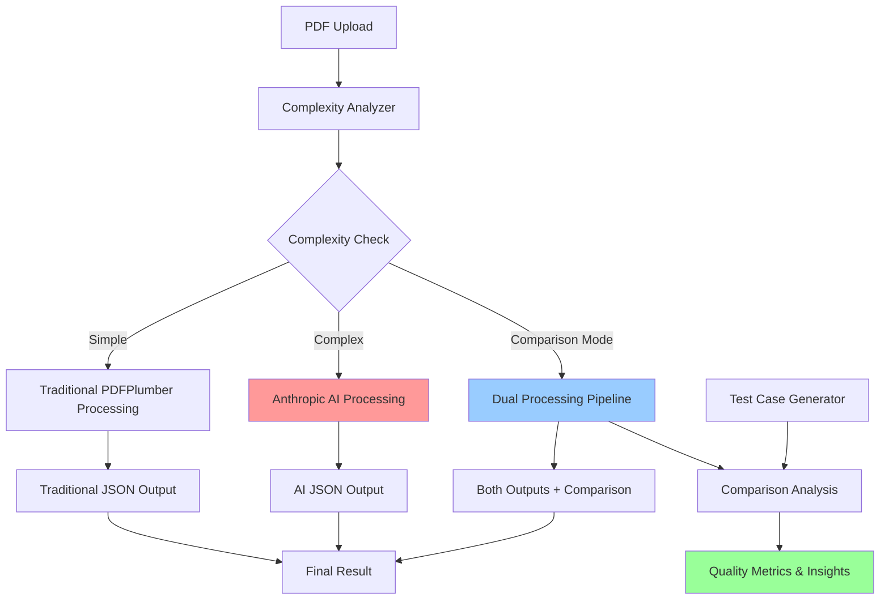
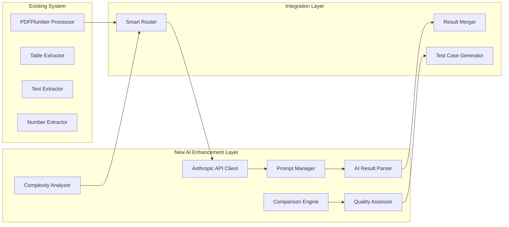

# Anthropic AI Enhancement Design
## PDF Processing with AI-Powered Extraction and Complexity Failover

**Version:** 1.0  
**Date:** January 2025  
**Status:** Design Phase  

---

## 📋 Executive Summary

This document outlines the design and implementation plan for enhancing the existing PDF extraction system with Anthropic AI capabilities. The enhancement will add AI-powered extraction as both a comparison tool for improving traditional techniques and as a smart failover mechanism for complex documents.

### Key Objectives
1. **Comparison Dataset Generation**: Use Anthropic AI to extract text, numbers, and tables to create robust test cases
2. **Complexity-Based Failover**: Automatically detect complex documents and use Anthropic AI when traditional methods struggle
3. **Quality Improvement**: Leverage AI extraction results to enhance traditional coding techniques
4. **Seamless Integration**: Maintain existing API compatibility while adding new AI capabilities

---

## 🏗️ System Architecture

### High-Level Architecture



### Component Architecture



---

## 🧠 Core Components Design

### 1. Complexity Analyzer (`complexity_analyzer.py`)

**Purpose**: Determine document complexity to decide between traditional and AI processing

**Complexity Metrics:**
- **Table Complexity**: Number of tables, nested structures, merged cells
- **Layout Complexity**: Multi-column layouts, irregular text flow, graphics overlap
- **Content Density**: Text-to-whitespace ratio, font variations, formatting complexity
- **Processing History**: Previous failure rates for similar documents

**Implementation:**
```python
class ComplexityAnalyzer:
    def __init__(self, thresholds=None):
        self.thresholds = thresholds or self._default_thresholds()
    
    def analyze_complexity(self, pdf_path):
        """Analyze PDF complexity and return complexity score"""
        metrics = {
            'table_complexity': self._analyze_tables(pdf_path),
            'layout_complexity': self._analyze_layout(pdf_path),
            'content_density': self._analyze_content(pdf_path),
            'extraction_difficulty': self._predict_difficulty(pdf_path)
        }
        
        overall_score = self._calculate_complexity_score(metrics)
        
        return {
            'complexity_score': overall_score,
            'complexity_level': self._get_complexity_level(overall_score),
            'metrics': metrics,
            'recommendation': self._get_processing_recommendation(overall_score)
        }
```

### 2. Anthropic API Client (`anthropic_client.py`)

**Purpose**: Handle all interactions with Anthropic's API including file uploads and structured prompting

**Features:**
- File upload management
- Prompt template management
- Response parsing and validation
- Error handling and retry logic
- Rate limiting and quota management

**Implementation:**
```python
class AnthropicClient:
    def __init__(self, api_key, model="claude-3-5-sonnet-20241022"):
        self.client = anthropic.Anthropic(api_key=api_key)
        self.model = model
        
    def extract_pdf_content(self, pdf_path, extraction_type="comprehensive"):
        """Extract content from PDF using Anthropic AI"""
        prompt = self._build_extraction_prompt(extraction_type)
        
        try:
            response = self.client.beta.messages.create(
                model=self.model,
                max_tokens=8192,
                messages=[{
                    "role": "user",
                    "content": [
                        {"type": "document", "source": {"type": "base64", "media_type": "application/pdf", "data": self._encode_pdf(pdf_path)}},
                        {"type": "text", "text": prompt}
                    ]
                }]
            )
            
            return self._parse_ai_response(response.content[0].text)
            
        except Exception as e:
            raise AnthropicProcessingError(f"AI extraction failed: {str(e)}")
```

### 3. Prompt Manager (`prompt_manager.py`)

**Purpose**: Manage AI prompts for different extraction scenarios with JSON schema integration

**Prompt Categories:**
- **Comprehensive Extraction**: Full document analysis with tables, text, and numbers
- **Table-Focused Extraction**: Specialized for complex table structures
- **Text-Focused Extraction**: Optimized for text and number extraction
- **Comparison Extraction**: Structured for test case generation

**Implementation:**
```python
class PromptManager:
    def __init__(self, schema_manager):
        self.schema_manager = schema_manager
        self.prompts = self._load_prompt_templates()
    
    def build_extraction_prompt(self, extraction_type, document_context=None):
        """Build structured prompt with JSON schema"""
        base_prompt = self.prompts[extraction_type]
        schema = self.schema_manager.get_schema(extraction_type)
        
        return f"""
{base_prompt}

IMPORTANT: You must return your response as valid JSON following this exact schema:

{json.dumps(schema, indent=2)}

Please extract all relevant information from the PDF document and structure it according to this schema. Pay special attention to:

1. **Tables**: Extract all tabular data with proper row/column structure
2. **Numbers**: Identify all numerical values with their context and formatting
3. **Text**: Organize text content into logical sections with metadata
4. **Positioning**: Include spatial information where possible
5. **Quality**: Provide confidence scores for extracted data

Return only the JSON response without any additional commentary.
"""
```

### 4. AI Result Parser (`ai_result_parser.py`)

**Purpose**: Parse and validate AI responses, converting them to system-compatible format

**Features:**
- JSON validation against schemas
- Error handling for malformed responses
- Data type conversion and normalization
- Confidence score extraction
- Metadata enhancement

### 5. Comparison Engine (`comparison_engine.py`)

**Purpose**: Compare traditional and AI extraction results to generate insights and test cases

**Comparison Metrics:**
- **Accuracy**: Correctness of extracted data
- **Completeness**: Coverage of all content
- **Structure**: Quality of data organization
- **Performance**: Processing time and resource usage

---

## 📊 Data Schemas and Integration

### Enhanced PDF Processing Result Schema

```json
{
  "pdf_processing_result": {
    "document_metadata": {
      "filename": "string",
      "total_pages": "number",
      "processing_timestamp": "string (ISO 8601)",
      "processing_duration": "number (seconds)",
      "complexity_analysis": {
        "complexity_score": "number (0.0-1.0)",
        "complexity_level": "simple|moderate|complex|extreme",
        "metrics": {
          "table_complexity": "number",
          "layout_complexity": "number", 
          "content_density": "number",
          "extraction_difficulty": "number"
        },
        "recommendation": "traditional|ai|dual"
      },
      "processing_method": "traditional|ai|dual",
      "extraction_methods": ["traditional", "ai"]
    },
    "traditional_result": {
      // Existing PDFPlumber result structure
    },
    "ai_result": {
      "extraction_metadata": {
        "model_used": "string",
        "processing_time": "number",
        "confidence_score": "number (0.0-1.0)",
        "api_usage": {
          "tokens_used": "number",
          "cost_estimate": "number"
        }
      },
      "extracted_content": {
        // AI-extracted content in same format as traditional
      }
    },
    "comparison_analysis": {
      "accuracy_score": "number (0.0-1.0)",
      "completeness_score": "number (0.0-1.0)",
      "quality_metrics": {
        "table_extraction_accuracy": "number",
        "number_extraction_accuracy": "number",
        "text_extraction_quality": "number"
      },
      "differences": {
        "tables_found": {
          "traditional": "number",
          "ai": "number"
        },
        "numbers_found": {
          "traditional": "number", 
          "ai": "number"
        },
        "content_differences": ["string"]
      }
    },
    "final_result": {
      // Best combined result or single method result
    }
  }
}
```

### Test Case Generation Schema

```json
{
  "test_case": {
    "test_id": "string",
    "generated_timestamp": "string (ISO 8601)",
    "source_document": {
      "filename": "string",
      "complexity_level": "string",
      "characteristics": ["string"]
    },
    "ground_truth": {
      "method": "ai|manual|consensus",
      "confidence": "number (0.0-1.0)",
      "validated_by": "string",
      "validation_date": "string (ISO 8601)"
    },
    "test_scenarios": [
      {
        "scenario_name": "string",
        "input_parameters": {},
        "expected_output": {},
        "success_criteria": {
          "min_accuracy": "number",
          "min_completeness": "number",
          "max_processing_time": "number"
        }
      }
    ],
    "performance_benchmarks": {
      "traditional_method": {
        "processing_time": "number",
        "accuracy": "number",
        "completeness": "number"
      },
      "ai_method": {
        "processing_time": "number", 
        "accuracy": "number",
        "completeness": "number"
      }
    }
  }
}
```

---

## 🔧 Implementation Plan

### Phase 1: Foundation Components (Weeks 1-2)

#### Week 1: Core Infrastructure
1. **Set up Anthropic API Integration**
   - Install Anthropic Python SDK
   - Configure API credentials and environment
   - Create basic API client with authentication
   - Implement file upload functionality

2. **Create Complexity Analyzer**
   - Implement basic complexity metrics
   - Create scoring algorithm
   - Add configuration management
   - Test with sample documents

3. **Design Prompt Templates**
   - Create base prompt templates for different extraction types
   - Integrate JSON schemas into prompts
   - Implement prompt versioning
   - Test prompts with sample documents

#### Week 2: AI Processing Pipeline
1. **Implement AI Result Parser**
   - Create JSON validation and parsing
   - Implement error handling
   - Add data type conversion
   - Create response normalization

2. **Build Smart Router**
   - Implement processing decision logic
   - Create fallback mechanisms
   - Add configuration options
   - Integrate with existing pipeline

3. **Initial Testing**
   - Test basic AI extraction functionality
   - Validate prompt responses
   - Test complexity analysis
   - Document initial findings

### Phase 2: Comparison and Analysis (Weeks 3-4)

#### Week 3: Comparison Engine
1. **Implement Comparison Logic**
   - Create result comparison algorithms
   - Implement similarity scoring
   - Add difference detection
   - Create quality metrics

2. **Test Case Generator**
   - Implement automated test case creation
   - Add ground truth validation
   - Create performance benchmarking
   - Implement test case storage

3. **Quality Assessment**
   - Create accuracy measurement tools
   - Implement completeness analysis
   - Add confidence scoring
   - Create quality reports

#### Week 4: Integration and Enhancement
1. **Django Integration**
   - Create new API endpoints
   - Update existing views
   - Add configuration management
   - Implement caching

2. **Web Interface Updates**
   - Add AI processing options
   - Create comparison views
   - Add progress indicators
   - Implement result visualization

3. **Documentation and Testing**
   - Create comprehensive tests
   - Update API documentation
   - Create user guides
   - Validate all functionality

### Phase 3: Advanced Features (Weeks 5-6)

#### Week 5: Optimization and Learning
1. **Performance Optimization**
   - Implement result caching
   - Add batch processing
   - Optimize API usage
   - Add monitoring

2. **Learning System**
   - Implement feedback collection
   - Create model improvement tracking
   - Add success rate monitoring
   - Implement adaptive thresholds

3. **Advanced Heuristics**
   - Implement complexity learning
   - Add document classification
   - Create processing recommendations
   - Add success prediction

#### Week 6: Production Readiness
1. **Error Handling and Monitoring**
   - Comprehensive error handling
   - Add logging and monitoring
   - Implement alerting
   - Create health checks

2. **Security and Compliance**
   - Implement API key management
   - Add request validation
   - Create audit logging
   - Ensure data privacy

3. **Final Testing and Deployment**
   - Comprehensive testing
   - Performance testing
   - Security testing
   - Documentation completion

---

## 🚀 API Enhancements

### New Endpoints

#### 1. AI-Powered PDF Processing
```
POST /api/pdf/process-ai/
Content-Type: multipart/form-data

Parameters:
- file: PDF file
- processing_mode: "ai_only" | "traditional_only" | "dual" | "auto"
- extraction_focus: "comprehensive" | "tables" | "text" | "numbers"
- generate_test_case: boolean

Response: Enhanced PDF processing result with AI data
```

#### 2. Complexity Analysis
```
POST /api/pdf/analyze-complexity/
Content-Type: multipart/form-data

Parameters:
- file: PDF file

Response: Complexity analysis with processing recommendations
```

#### 3. Comparison Analysis
```
POST /api/pdf/compare-methods/
Content-Type: multipart/form-data

Parameters:
- file: PDF file
- baseline_method: "traditional" | "ai"

Response: Detailed comparison between processing methods
```

#### 4. Test Case Generation
```
POST /api/test-cases/generate/
Content-Type: multipart/form-data

Parameters:
- file: PDF file
- validation_method: "ai" | "manual"
- complexity_target: "simple" | "moderate" | "complex"

Response: Generated test case with ground truth data
```

#### 5. Processing Analytics
```
GET /api/analytics/processing-stats/

Parameters:
- date_range: ISO date range
- method_filter: "traditional" | "ai" | "all"

Response: Processing statistics and quality metrics
```

### Enhanced Existing Endpoints

Update existing PDF processing endpoint to include AI capabilities:

```
POST /api/pdf/upload/
Additional Parameters:
- enable_ai_fallback: boolean (default: true)
- complexity_threshold: number (0.0-1.0, default: 0.7)
- ai_model: "claude-3-5-sonnet" | "claude-3-haiku" (default: sonnet)
```

---

## 🔐 Security and Configuration

### Environment Configuration

```env
# Anthropic API Configuration
ANTHROPIC_API_KEY=your_api_key_here
ANTHROPIC_MODEL=claude-3-5-sonnet-20241022
ANTHROPIC_MAX_TOKENS=8192
ANTHROPIC_TIMEOUT=60

# AI Processing Configuration
AI_PROCESSING_ENABLED=true
AI_FALLBACK_ENABLED=true
COMPLEXITY_THRESHOLD=0.7
MAX_FILE_SIZE_MB=50

# Performance Configuration
ENABLE_RESULT_CACHING=true
CACHE_EXPIRY_HOURS=24
MAX_CONCURRENT_AI_REQUESTS=5

# Quality Assurance
ENABLE_COMPARISON_LOGGING=true
GENERATE_TEST_CASES=true
MIN_CONFIDENCE_THRESHOLD=0.8
```

### Security Considerations

1. **API Key Management**
   - Store API keys securely using environment variables
   - Implement key rotation capabilities
   - Add usage monitoring and alerts

2. **Data Privacy**
   - Ensure PDFs are processed securely
   - Implement data retention policies
   - Add option for local-only processing

3. **Rate Limiting**
   - Implement intelligent rate limiting
   - Add queue management for AI requests
   - Create fallback mechanisms

---

## 📈 Quality Assurance and Testing

### Testing Strategy

#### 1. Unit Tests
- Test individual components (Complexity Analyzer, AI Client, etc.)
- Validate prompt generation and response parsing
- Test error handling and edge cases

#### 2. Integration Tests
- Test complete AI processing pipeline
- Validate schema compliance
- Test API endpoint functionality

#### 3. Comparison Tests
- Compare AI vs traditional results on known documents
- Validate test case generation quality
- Test complexity analysis accuracy

#### 4. Performance Tests
- Measure processing times under load
- Test API rate limiting
- Validate memory usage

### Quality Metrics

#### 1. Extraction Quality
- **Accuracy**: Percentage of correctly extracted data
- **Completeness**: Percentage of content successfully extracted
- **Consistency**: Reliability across similar documents

#### 2. System Performance
- **Processing Speed**: Time per document by complexity
- **API Efficiency**: Tokens used vs value delivered
- **Resource Usage**: Memory and CPU utilization

#### 3. Business Metrics
- **Cost Effectiveness**: Processing cost vs quality improvement
- **Success Rate**: Percentage of successful AI extractions
- **User Satisfaction**: Quality of results vs traditional methods

---

## 💰 Cost Management

### API Usage Optimization

1. **Intelligent Caching**
   - Cache AI results for similar documents
   - Implement hash-based duplicate detection
   - Store frequently accessed results

2. **Model Selection**
   - Use Claude-3-Haiku for simpler documents
   - Reserve Claude-3-Sonnet for complex extractions
   - Implement dynamic model selection

3. **Request Optimization**
   - Batch similar requests when possible
   - Optimize prompt length
   - Implement progressive processing

### Cost Monitoring

```python
class CostMonitor:
    def track_usage(self, model, tokens_used, processing_time):
        """Track API usage and costs"""
        cost = self.calculate_cost(model, tokens_used)
        
        self.usage_db.record({
            'timestamp': datetime.now(),
            'model': model,
            'tokens_used': tokens_used,
            'estimated_cost': cost,
            'processing_time': processing_time
        })
        
        if self.check_budget_threshold():
            self.send_cost_alert()
```

---

## 🔄 Deployment and Rollout

### Deployment Strategy

#### Phase 1: Internal Testing (Week 7)
- Deploy to staging environment
- Internal team testing
- Performance validation
- Security review

#### Phase 2: Limited Beta (Week 8)
- Select user beta testing
- Feedback collection
- Performance monitoring
- Issue resolution

#### Phase 3: Gradual Rollout (Week 9-10)
- Feature flag implementation
- Gradual user exposure
- Monitoring and optimization
- Full production deployment

### Rollback Plan

1. **Feature Flags**
   - Implement feature toggles for AI processing
   - Allow instant disable if issues occur
   - Maintain traditional processing as fallback

2. **Database Migrations**
   - All database changes are backward compatible
   - Maintain existing API endpoints
   - Preserve existing functionality

3. **Monitoring and Alerts**
   - Real-time error rate monitoring
   - Performance degradation alerts
   - Automatic rollback triggers

---

## 📚 Documentation and Training

### Technical Documentation
1. **API Documentation**: Updated OpenAPI specifications
2. **Integration Guide**: How to use new AI features
3. **Troubleshooting Guide**: Common issues and solutions
4. **Performance Tuning**: Optimization recommendations

### User Documentation
1. **Feature Overview**: What's new with AI processing
2. **Usage Guide**: How to use AI features effectively
3. **Cost Guide**: Understanding API usage and costs
4. **Best Practices**: Maximizing extraction quality

### Training Materials
1. **Developer Training**: Technical implementation details
2. **User Training**: How to leverage new capabilities
3. **Admin Training**: Configuration and monitoring

---

## 🎯 Success Metrics

### Technical Success Criteria
- [ ] AI processing achieves >90% accuracy on complex documents
- [ ] System maintains <30s processing time for typical documents
- [ ] API availability >99.9%
- [ ] Comparison engine generates meaningful insights

### Business Success Criteria
- [ ] 25% improvement in extraction accuracy for complex documents
- [ ] 50% reduction in manual intervention for difficult cases
- [ ] Cost per document remains competitive
- [ ] User satisfaction scores improve by 20%

### Quality Assurance Criteria
- [ ] Test case generation produces 100+ high-quality test cases
- [ ] Traditional method improvements show measurable gains
- [ ] AI failover reduces processing failures by 60%
- [ ] System handles 10x current volume without degradation

---

## 🔮 Future Enhancements

### Phase 4: Advanced AI Features (Future)
1. **Multi-Modal Processing**: Support for images, charts, and complex layouts
2. **Custom Model Training**: Fine-tuned models for specific document types
3. **Real-Time Processing**: Streaming processing for large documents
4. **Collaborative AI**: Human-in-the-loop validation and correction

### Phase 5: Intelligence Layer (Future)
1. **Document Classification**: Automatic document type detection
2. **Quality Prediction**: Predict extraction success before processing
3. **Adaptive Learning**: Continuously improve based on feedback
4. **Recommendation Engine**: Suggest optimal processing parameters

---

## 📝 Conclusion

This enhancement will transform the PDF extraction system into an intelligent, adaptive platform that leverages the power of AI while maintaining the reliability of traditional methods. The dual-processing approach ensures optimal results while building a foundation for continuous improvement through AI-generated test cases and insights.

The implementation follows a careful, phased approach that minimizes risk while maximizing value. The system will be more accurate, more reliable, and more capable of handling complex documents than ever before.

**Next Steps:**
1. Review and approve this design document
2. Set up development environment with Anthropic API access
3. Begin Phase 1 implementation
4. Establish monitoring and quality assurance processes
5. Start building the enhanced extraction system

---

*This document will be updated as the implementation progresses and new insights are gained from testing and user feedback.* 