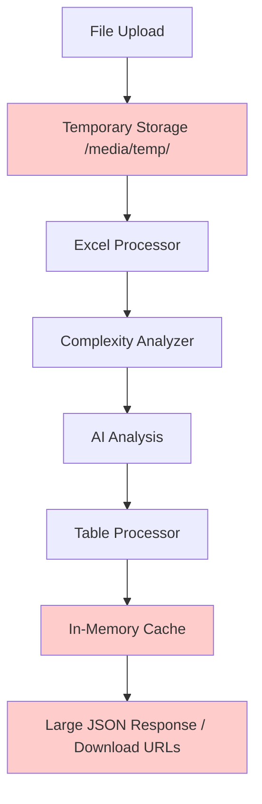
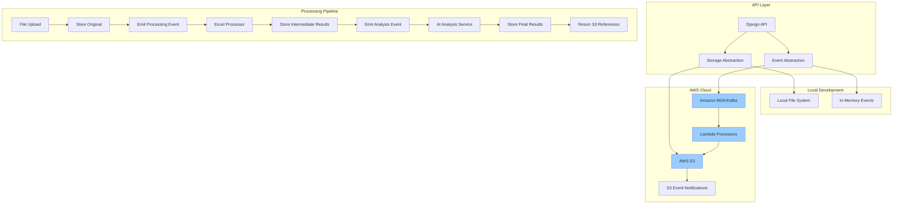
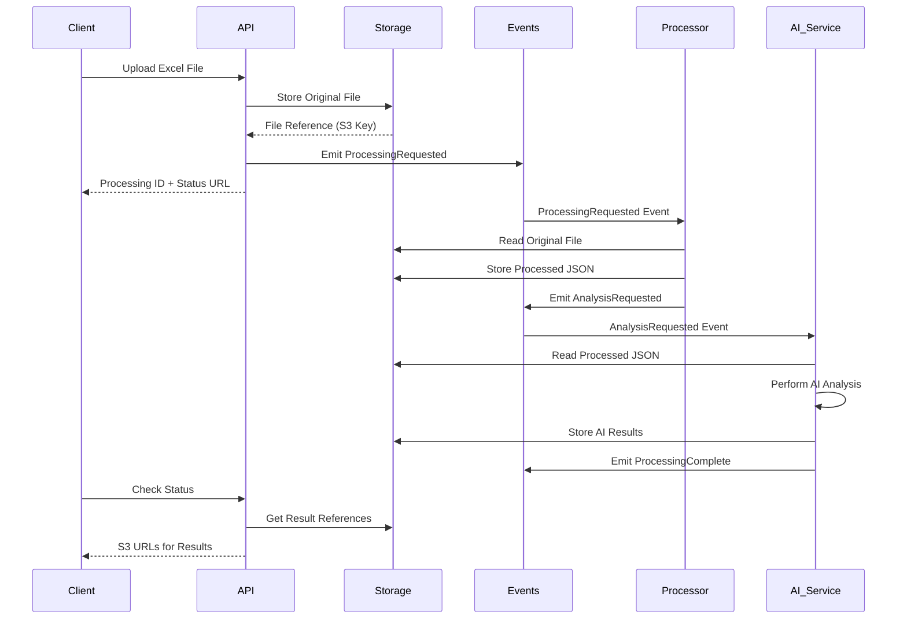

# AWS S3 & Kafka Architecture Design
## Event-Driven Excel Processing with Cloud/Local Abstraction

**Version:** 1.0  
**Date:** January 2025  
**Status:** Design Phase  

---

## 📋 Executive Summary

This document outlines the architectural design for transforming the Excel processing system into a cloud-ready, event-driven architecture using S3 for storage and Kafka for event streaming. The design provides seamless abstraction between local development and AWS cloud deployment, enabling scalable processing while maintaining API compatibility.

### Key Objectives
1. **Cloud-Native Storage**: Use S3 for all intermediate results and processed data
2. **Event-Driven Processing**: Implement Kafka-based event streaming for async processing
3. **Local Development**: Maintain local filesystem and in-memory event handling for development
4. **API Integration**: Return S3 references instead of large JSON payloads
5. **Scalability**: Enable horizontal scaling and microservice decomposition
6. **Cost Optimization**: Reduce API response sizes and enable caching strategies

---

## 🔍 Current State Analysis

### Current Data Flow


### Current Storage Patterns
- **Temporary Files**: Django's `default_storage` with local filesystem
- **Processed Data**: In-memory dictionary cache (`processed_data_cache`)
- **Large Files**: Download URLs with ephemeral storage
- **Results**: Direct JSON responses or file downloads

### Current Integration Points
- **AI Analysis**: Anthropic API integration per sheet
- **File Processing**: Synchronous processing pipeline
- **API Responses**: Large JSON payloads (up to 10MB+)

---

## 🎯 Proposed Architecture

### High-Level Architecture Overview


### Event-Driven Processing Flow


---

## 🏗️ Architecture Components

### 1. Storage Abstraction Layer

#### Interface Definition
```python
from abc import ABC, abstractmethod
from typing import Dict, Any, Optional, List
from dataclasses import dataclass
from enum import Enum

class StorageType(Enum):
    ORIGINAL_FILE = "original"
    PROCESSED_JSON = "processed"
    AI_ANALYSIS = "ai_analysis"
    TABLE_DATA = "table_data"
    COMPLEXITY_METADATA = "complexity"

@dataclass
class StorageReference:
    """Reference to stored data with metadata"""
    key: str
    storage_type: StorageType
    content_type: str
    size_bytes: int
    created_at: str
    metadata: Dict[str, Any]
    download_url: Optional[str] = None
    presigned_expires: Optional[str] = None

class StorageService(ABC):
    """Abstract storage service interface"""
    
    @abstractmethod
    def store_file(self, data: bytes, storage_type: StorageType, 
                   filename: str, metadata: Dict[str, Any] = None) -> StorageReference:
        """Store file data and return reference"""
        pass
    
    @abstractmethod
    def store_json(self, data: Dict[str, Any], storage_type: StorageType,
                   key_prefix: str, metadata: Dict[str, Any] = None) -> StorageReference:
        """Store JSON data and return reference"""
        pass
    
    @abstractmethod
    def get_download_url(self, reference: StorageReference, 
                        expires_in: int = 3600) -> str:
        """Get presigned download URL"""
        pass
    
    @abstractmethod
    def get_data(self, reference: StorageReference) -> bytes:
        """Retrieve raw data"""
        pass
    
    @abstractmethod
    def get_json(self, reference: StorageReference) -> Dict[str, Any]:
        """Retrieve JSON data"""
        pass
    
    @abstractmethod
    def delete(self, reference: StorageReference) -> bool:
        """Delete stored data"""
        pass
    
    @abstractmethod
    def list_by_prefix(self, prefix: str) -> List[StorageReference]:
        """List all items with given prefix"""
        pass
```

#### Local Development Implementation
```python
class LocalStorageService(StorageService):
    """Local filesystem implementation for development"""
    
    def __init__(self, base_path: str = "/tmp/excel_processor"):
        self.base_path = Path(base_path)
        self.base_path.mkdir(exist_ok=True)
        self.metadata_store = {}  # In-memory metadata storage
    
    def store_file(self, data: bytes, storage_type: StorageType, 
                   filename: str, metadata: Dict[str, Any] = None) -> StorageReference:
        key = f"{storage_type.value}/{uuid.uuid4()}/{filename}"
        file_path = self.base_path / key
        file_path.parent.mkdir(parents=True, exist_ok=True)
        
        with open(file_path, 'wb') as f:
            f.write(data)
        
        reference = StorageReference(
            key=key,
            storage_type=storage_type,
            content_type=self._get_content_type(filename),
            size_bytes=len(data),
            created_at=datetime.now().isoformat(),
            metadata=metadata or {}
        )
        
        self.metadata_store[key] = reference
        return reference
```

#### AWS S3 Implementation
```python
class S3StorageService(StorageService):
    """AWS S3 implementation for cloud deployment"""
    
    def __init__(self, bucket_name: str, region: str = "us-east-1"):
        self.bucket_name = bucket_name
        self.s3_client = boto3.client('s3', region_name=region)
        self.region = region
    
    def store_file(self, data: bytes, storage_type: StorageType, 
                   filename: str, metadata: Dict[str, Any] = None) -> StorageReference:
        key = f"{storage_type.value}/{uuid.uuid4()}/{filename}"
        
        # Store file in S3
        self.s3_client.put_object(
            Bucket=self.bucket_name,
            Key=key,
            Body=data,
            ContentType=self._get_content_type(filename),
            Metadata=self._serialize_metadata(metadata or {})
        )
        
        return StorageReference(
            key=key,
            storage_type=storage_type,
            content_type=self._get_content_type(filename),
            size_bytes=len(data),
            created_at=datetime.now().isoformat(),
            metadata=metadata or {}
        )
    
    def get_download_url(self, reference: StorageReference, 
                        expires_in: int = 3600) -> str:
        return self.s3_client.generate_presigned_url(
            'get_object',
            Params={'Bucket': self.bucket_name, 'Key': reference.key},
            ExpiresIn=expires_in
        )
```

### 2. Event System Abstraction

#### Interface Definition
```python
from abc import ABC, abstractmethod
from typing import Dict, Any, Callable
from dataclasses import dataclass
from enum import Enum

class EventType(Enum):
    FILE_UPLOADED = "file.uploaded"
    PROCESSING_REQUESTED = "processing.requested"
    PROCESSING_STARTED = "processing.started"
    PROCESSING_COMPLETED = "processing.completed"
    ANALYSIS_REQUESTED = "analysis.requested"
    ANALYSIS_COMPLETED = "analysis.completed"
    ERROR_OCCURRED = "error.occurred"

@dataclass
class ProcessingEvent:
    """Standard event structure"""
    event_id: str
    event_type: EventType
    timestamp: str
    processing_id: str
    data: Dict[str, Any]
    correlation_id: Optional[str] = None

class EventService(ABC):
    """Abstract event service interface"""
    
    @abstractmethod
    def publish(self, event: ProcessingEvent) -> bool:
        """Publish an event"""
        pass
    
    @abstractmethod
    def subscribe(self, event_type: EventType, 
                 handler: Callable[[ProcessingEvent], None]) -> str:
        """Subscribe to events of a specific type"""
        pass
    
    @abstractmethod
    def unsubscribe(self, subscription_id: str) -> bool:
        """Unsubscribe from events"""
        pass
```

#### Local Development Implementation
```python
class LocalEventService(EventService):
    """In-memory event service for development"""
    
    def __init__(self):
        self.subscribers: Dict[EventType, List[Callable]] = {}
        self.event_queue = []
    
    def publish(self, event: ProcessingEvent) -> bool:
        logger.info(f"Publishing event: {event.event_type.value}")
        
        # Add to queue for debugging
        self.event_queue.append(event)
        
        # Notify subscribers
        handlers = self.subscribers.get(event.event_type, [])
        for handler in handlers:
            try:
                handler(event)
            except Exception as e:
                logger.error(f"Event handler failed: {e}")
        
        return True
```

#### Kafka Implementation
```python
class KafkaEventService(EventService):
    """Kafka implementation for cloud deployment"""
    
    def __init__(self, bootstrap_servers: str, topic_prefix: str = "excel_processing"):
        self.producer = KafkaProducer(
            bootstrap_servers=bootstrap_servers,
            value_serializer=lambda v: json.dumps(v).encode('utf-8')
        )
        self.topic_prefix = topic_prefix
        self.consumers = {}
    
    def publish(self, event: ProcessingEvent) -> bool:
        topic = f"{self.topic_prefix}.{event.event_type.value}"
        
        try:
            self.producer.send(topic, value=asdict(event))
            self.producer.flush()
            return True
        except Exception as e:
            logger.error(f"Failed to publish event: {e}")
            return False
```

### 3. Processing Service Architecture

#### Enhanced Processing Pipeline
```python
class ProcessingService:
    """Main processing orchestrator"""
    
    def __init__(self, storage: StorageService, events: EventService):
        self.storage = storage
        self.events = events
        self.processors = {
            'excel': ExcelProcessorService(storage, events),
            'complexity': ComplexityAnalysisService(storage, events),
            'ai': AIAnalysisService(storage, events),
            'table': TableProcessorService(storage, events)
        }
    
    async def process_file(self, uploaded_file, processing_options: Dict[str, Any]) -> Dict[str, Any]:
        """Main entry point for file processing"""
        processing_id = str(uuid.uuid4())
        
        try:
            # Store original file
            original_ref = self.storage.store_file(
                data=uploaded_file.read(),
                storage_type=StorageType.ORIGINAL_FILE,
                filename=uploaded_file.name,
                metadata={'processing_id': processing_id}
            )
            
            # Emit processing event
            event = ProcessingEvent(
                event_id=str(uuid.uuid4()),
                event_type=EventType.PROCESSING_REQUESTED,
                timestamp=datetime.now().isoformat(),
                processing_id=processing_id,
                data={
                    'original_file_ref': asdict(original_ref),
                    'processing_options': processing_options
                }
            )
            
            self.events.publish(event)
            
            return {
                'processing_id': processing_id,
                'status': 'processing',
                'original_file': {
                    'reference': asdict(original_ref),
                    'download_url': self.storage.get_download_url(original_ref)
                },
                'status_url': f'/api/status/{processing_id}',
                'estimated_completion': self._estimate_completion(uploaded_file.size)
            }
            
        except Exception as e:
            logger.error(f"Processing failed: {e}")
            return {'error': str(e), 'processing_id': processing_id}
```

### 4. API Response Format

#### New API Response Structure
```python
@dataclass
class ProcessingResult:
    """Standard processing result format"""
    processing_id: str
    status: str  # 'processing', 'completed', 'failed'
    created_at: str
    completed_at: Optional[str]
    file_info: Dict[str, Any]
    references: Dict[str, StorageReference]
    download_urls: Dict[str, str]
    metadata: Dict[str, Any]
    
# Example API Response
{
    "processing_id": "550e8400-e29b-41d4-a716-446655440000",
    "status": "completed",
    "created_at": "2025-01-08T10:30:00Z",
    "completed_at": "2025-01-08T10:31:45Z",
    "file_info": {
        "filename": "financial_model.xlsx",
        "size_bytes": 2048576,
        "sheets_count": 5,
        "tables_detected": 12
    },
    "references": {
        "original_file": {
            "key": "original/550e8400-e29b-41d4-a716-446655440000/financial_model.xlsx",
            "storage_type": "original",
            "content_type": "application/vnd.openxmlformats-officedocument.spreadsheetml.sheet",
            "size_bytes": 2048576,
            "created_at": "2025-01-08T10:30:00Z"
        },
        "processed_json": {
            "key": "processed/550e8400-e29b-41d4-a716-446655440000/data.json",
            "storage_type": "processed",
            "content_type": "application/json",
            "size_bytes": 5242880,
            "created_at": "2025-01-08T10:31:20Z"
        },
        "table_data": {
            "key": "table_data/550e8400-e29b-41d4-a716-446655440000/tables.json",
            "storage_type": "table_data",
            "content_type": "application/json",
            "size_bytes": 1048576,
            "created_at": "2025-01-08T10:31:30Z"
        },
        "ai_analysis": {
            "key": "ai_analysis/550e8400-e29b-41d4-a716-446655440000/analysis.json",
            "storage_type": "ai_analysis",
            "content_type": "application/json",
            "size_bytes": 512000,
            "created_at": "2025-01-08T10:31:45Z"
        }
    },
    "download_urls": {
        "original_file": "https://excel-processor-bucket.s3.amazonaws.com/original/550e8400-e29b-41d4-a716-446655440000/financial_model.xlsx?X-Amz-Expires=3600&...",
        "processed_json": "https://excel-processor-bucket.s3.amazonaws.com/processed/550e8400-e29b-41d4-a716-446655440000/data.json?X-Amz-Expires=3600&...",
        "table_data": "https://excel-processor-bucket.s3.amazonaws.com/table_data/550e8400-e29b-41d4-a716-446655440000/tables.json?X-Amz-Expires=3600&...",
        "ai_analysis": "https://excel-processor-bucket.s3.amazonaws.com/ai_analysis/550e8400-e29b-41d4-a716-446655440000/analysis.json?X-Amz-Expires=3600&..."
    },
    "metadata": {
        "processing_time_seconds": 105,
        "complexity_scores": {
            "Sheet1": 0.3,
            "Financial_Model": 0.8,
            "Assumptions": 0.2
        },
        "ai_usage": {
            "sheets_analyzed": 1,
            "cost_usd": 0.045,
            "tokens_used": 3200
        }
    }
}
```

---

## 🚀 Implementation Phases

### Phase 1: Storage Abstraction (Week 1)
1. **Create Storage Interfaces**
   - Define abstract base classes
   - Implement local filesystem storage
   - Create S3 storage implementation
   
2. **Update Current Views**
   - Modify `upload_and_convert` to use storage abstraction
   - Update file handling in PDF processor
   - Add configuration management

3. **Testing & Validation**
   - Unit tests for both storage implementations
   - Integration tests with existing processors

### Phase 2: Event System (Week 2)
1. **Event Interfaces**
   - Define event types and structures
   - Implement local in-memory events
   - Create Kafka integration

2. **Async Processing**
   - Convert synchronous processing to event-driven
   - Add status tracking and polling endpoints
   - Implement error handling and retry logic

3. **Background Workers**
   - Create Celery/Lambda workers for processing
   - Implement event handlers for each processing stage

### Phase 3: API Enhancement (Week 3)
1. **New Response Format**
   - Update API responses to return references
   - Add status polling endpoints
   - Implement download URL generation

2. **Backward Compatibility**
   - Maintain existing endpoints with feature flags
   - Add migration path for existing clients

3. **Monitoring & Metrics**
   - Add CloudWatch/logging integration
   - Implement processing metrics and alerts

### Phase 4: AWS Deployment (Week 4)
1. **Infrastructure as Code**
   - CloudFormation/Terraform templates
   - S3 bucket configuration with lifecycle policies
   - MSK cluster setup

2. **Lambda Functions**
   - Processing workers as Lambda functions
   - S3 event triggers
   - Dead letter queues for error handling

3. **Security & Compliance**
   - IAM roles and policies
   - VPC configuration
   - Encryption at rest and in transit

---

## 🔧 Configuration Management

### Environment-Specific Settings
```python
# settings/base.py
STORAGE_BACKEND = os.getenv('STORAGE_BACKEND', 'local')  # 'local' or 's3'
EVENT_BACKEND = os.getenv('EVENT_BACKEND', 'local')      # 'local' or 'kafka'

# Local Development
if STORAGE_BACKEND == 'local':
    STORAGE_CONFIG = {
        'backend': 'converter.storage.LocalStorageService',
        'base_path': os.getenv('LOCAL_STORAGE_PATH', '/tmp/excel_processor')
    }
else:
    STORAGE_CONFIG = {
        'backend': 'converter.storage.S3StorageService',
        'bucket_name': os.getenv('S3_BUCKET_NAME'),
        'region': os.getenv('AWS_REGION', 'us-east-1')
    }

if EVENT_BACKEND == 'local':
    EVENT_CONFIG = {
        'backend': 'converter.events.LocalEventService'
    }
else:
    EVENT_CONFIG = {
        'backend': 'converter.events.KafkaEventService',
        'bootstrap_servers': os.getenv('KAFKA_BOOTSTRAP_SERVERS'),
        'topic_prefix': os.getenv('KAFKA_TOPIC_PREFIX', 'excel_processing')
    }
```

### Docker Compose for Local Development
```yaml
version: '3.8'
services:
  web:
    build: .
    ports:
      - "8000:8000"
    environment:
      - STORAGE_BACKEND=local
      - EVENT_BACKEND=local
      - LOCAL_STORAGE_PATH=/app/storage
    volumes:
      - ./storage:/app/storage
      - .:/app
    depends_on:
      - kafka
      - localstack

  kafka:
    image: confluentinc/cp-kafka:latest
    environment:
      KAFKA_ZOOKEEPER_CONNECT: zookeeper:2181
      KAFKA_ADVERTISED_LISTENERS: PLAINTEXT://kafka:9092
      KAFKA_OFFSETS_TOPIC_REPLICATION_FACTOR: 1
    depends_on:
      - zookeeper

  zookeeper:
    image: confluentinc/cp-zookeeper:latest
    environment:
      ZOOKEEPER_CLIENT_PORT: 2181
      ZOOKEEPER_TICK_TIME: 2000

  localstack:
    image: localstack/localstack:latest
    environment:
      - SERVICES=s3
      - DEFAULT_REGION=us-east-1
    ports:
      - "4566:4566"
```

---

## 📊 Benefits & Trade-offs

### Benefits
1. **Scalability**: Event-driven architecture enables horizontal scaling
2. **Cost Efficiency**: Reduced API response sizes and S3 storage costs
3. **Integration Ready**: S3 references enable easy integration with other services
4. **Async Processing**: Non-blocking file processing improves user experience
5. **Cloud Native**: Leverages AWS managed services for reliability
6. **Development Friendly**: Local development with filesystem and in-memory events

### Trade-offs
1. **Complexity**: More moving parts and configuration
2. **Latency**: Async processing adds polling overhead for immediate results
3. **Dependencies**: Requires external services (S3, Kafka/MSK)
4. **Cost**: Additional AWS service costs (S3, MSK, Lambda)
5. **Learning Curve**: Team needs to understand event-driven patterns

### Migration Strategy
1. **Feature Flags**: Enable new architecture gradually
2. **Dual Mode**: Run both old and new systems in parallel
3. **Client Migration**: Provide migration guide for API consumers
4. **Rollback Plan**: Maintain ability to revert to original architecture

---

## 🔐 Security Considerations

### Data Security
- **Encryption**: All S3 objects encrypted at rest (AES-256)
- **Access Control**: IAM policies with least privilege principle
- **Network Security**: VPC endpoints for S3 access
- **Audit Logging**: CloudTrail for all API calls

### API Security
- **Authentication**: JWT tokens or API keys
- **Authorization**: Role-based access control
- **Rate Limiting**: Prevent abuse and control costs
- **Input Validation**: Strict file type and size validation

### Compliance
- **Data Retention**: Configurable lifecycle policies
- **GDPR Compliance**: Right to deletion support
- **SOC 2**: AWS compliance inheritance
- **Data Residency**: Regional deployment options

---

## 📈 Monitoring & Observability

### Metrics to Track
- Processing success/failure rates
- Processing duration by file size/complexity
- S3 storage usage and costs
- Kafka topic lag and throughput
- AI analysis costs and accuracy

### Alerting
- Processing failures
- High error rates
- Storage quota approaching limits
- Cost threshold breaches
- Performance degradation

### Dashboards
- Real-time processing status
- Cost analysis and trends
- Performance metrics
- System health indicators

---

## 🎯 Success Criteria

### Technical Success
- [ ] 99.9% uptime for processing API
- [ ] <2 second response time for upload endpoint
- [ ] <30 second P95 processing time for typical files
- [ ] 100% backward compatibility during migration

### Business Success
- [ ] 50% reduction in API response sizes
- [ ] Enable integration with 3+ external services
- [ ] Support for 10x current processing volume
- [ ] <$100/month additional AWS costs for typical usage

### Development Success
- [ ] Local development requires only Docker Compose
- [ ] Zero-downtime deployments
- [ ] Comprehensive test coverage (>90%)
- [ ] Documentation for all new APIs

---

This architecture provides a solid foundation for scaling the Excel processing system while maintaining development velocity and operational simplicity. The abstraction layers ensure the system works identically in local and cloud environments, making development and testing straightforward while enabling powerful cloud-native capabilities in production.
