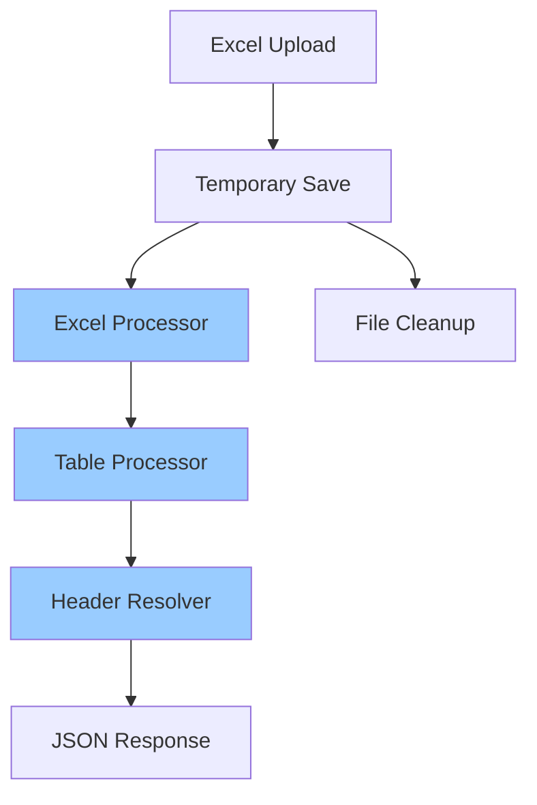
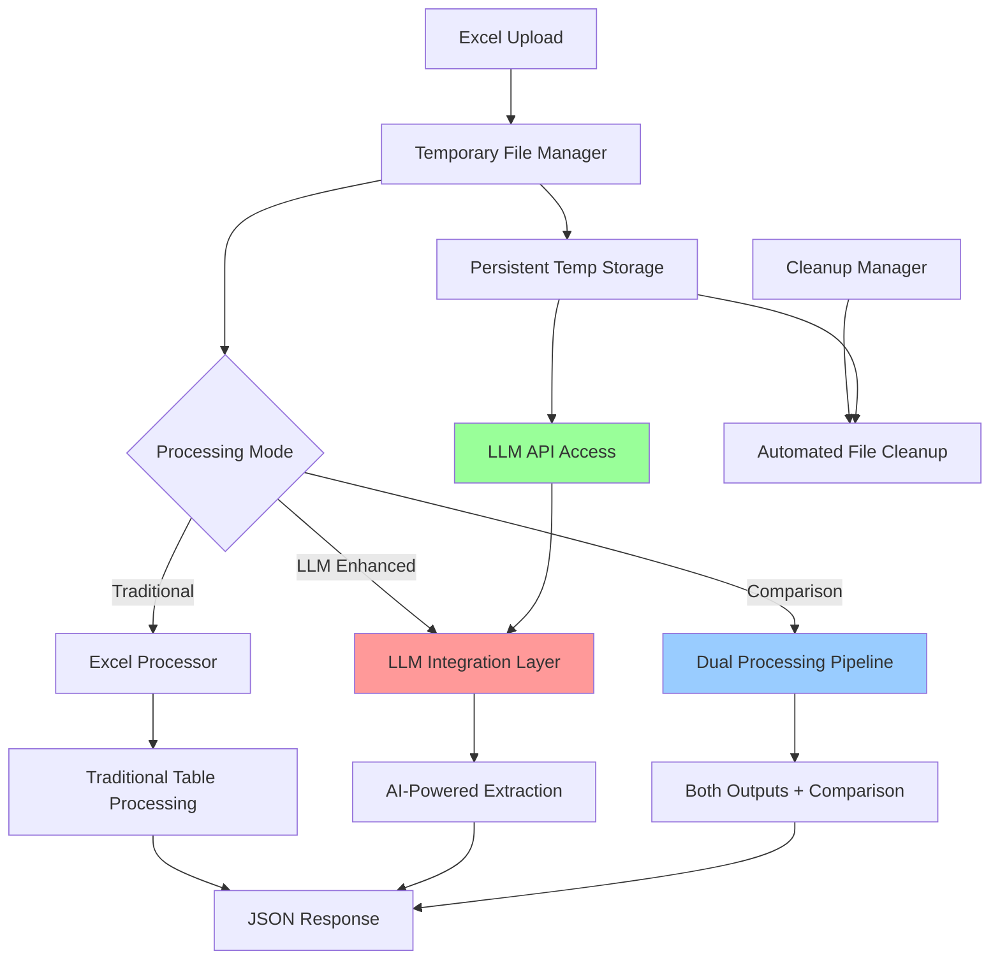
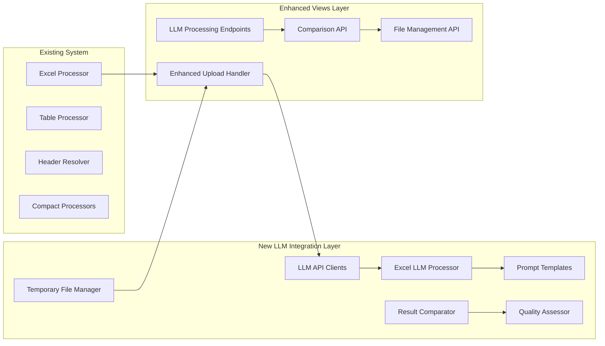

# Excel LLM Integration Plan
## Temporary File Storage for AI-Powered Excel Processing

**Version:** 1.0  
**Date:** January 2025  
**Status:** Planning Phase  

---

## 📋 Executive Summary

This document outlines the refactoring plan for enhancing the existing Excel extraction system to support LLM API integration. The enhancement will enable AI-powered table extraction and analysis by providing secure temporary file access to Excel files for external API processing.

### Key Objectives
1. **Temporary File Management**: Create persistent temporary storage for Excel files to pass to LLM APIs
2. **LLM API Integration**: Enable AI-assisted table extraction and analysis
3. **Comparison Capabilities**: Allow side-by-side traditional vs AI extraction results
4. **Backward Compatibility**: Maintain existing functionality while adding new AI features
5. **Research Data Generation**: Create datasets for improving traditional extraction methods

---

## 🔍 Current State Analysis

### Current File Handling Flow
1. Files are uploaded via Django's file upload system
2. Files are temporarily saved to `media/temp/` directory using `default_storage.save()`
3. Files are processed immediately by Excel processors
4. Temporary files are cleaned up after processing with `default_storage.delete()`
5. Processed data is cached in memory (`processed_data_cache`) for large files

### Existing Temporary File Patterns
- PDF processors use `tempfile.mkstemp()` for creating temporary files
- Files are tracked in `self.temp_files[]` arrays for cleanup
- AI enhancement architecture already designed (see `anthropic-ai-enhancement-design.md`)

### Current Processing Pipeline


---

## 🎯 Proposed Architecture

### Enhanced Processing Pipeline


### Component Architecture


---

## 🧠 Core Components Design

### 1. Temporary File Manager (`temp_file_manager.py`)

**Purpose**: Centralize temporary file handling with persistent storage for LLM access

```python
class TemporaryFileManager:
    """Manages temporary files for LLM API integration"""
    
    def __init__(self):
        self.temp_files = {}  # {file_id: file_info}
        self.temp_dir = settings.LLM_TEMP_DIR
    
    def create_temp_file(self, uploaded_file, retention_hours=1):
        """Create a temporary file from uploaded Django file"""
        
    def get_temp_path(self, file_id):
        """Get temporary file path by ID"""
        
    def cleanup_file(self, file_id):
        """Clean up specific temporary file"""
        
    def cleanup_expired(self):
        """Clean up expired temporary files"""
        
    def cleanup_all(self):
        """Clean up all managed temporary files"""
```

**Features:**
- UUID-based file tracking for security
- Configurable retention periods
- Automatic cleanup of expired files
- Thread-safe operations
- File metadata tracking

### 2. LLM Integration Base Classes

**Directory Structure:**
```
converter/llm_integration/
├── __init__.py
├── excel_llm_processor.py      # Excel-specific LLM processing
├── api_clients.py              # LLM API clients (Anthropic, OpenAI, etc.)
├── prompt_templates.py         # Excel extraction prompts
├── result_parser.py            # Parse LLM responses to JSON
└── comparator.py               # Compare traditional vs LLM results
```

**Excel LLM Processor:**
```python
class ExcelLLMProcessor:
    """Process Excel files using LLM APIs for enhanced extraction"""
    
    def __init__(self, api_client):
        self.api_client = api_client
        self.prompt_templates = ExcelPromptTemplates()
    
    def analyze_complexity(self, file_path):
        """Determine if LLM processing would be beneficial"""
        
    def extract_tables_with_llm(self, file_path, complexity_hints=None):
        """Use LLM to extract and analyze tables"""
        
    def enhance_traditional_results(self, traditional_results, file_path):
        """Use LLM to enhance traditional extraction results"""
```

### 3. Enhanced Upload Handler

**Modified `upload_and_convert()` function:**

```python
@csrf_exempt
@require_http_methods(["POST"])
def upload_and_convert(request):
    """
    Enhanced upload handler with LLM integration options
    
    New parameters:
    - ?processing_mode=traditional|llm|comparison
    - ?llm_provider=anthropic|openai
    - ?retain_file=true|false (for LLM access)
    """
    
    # Existing validation logic...
    
    # New: Temporary file management
    temp_manager = TemporaryFileManager()
    processing_mode = request.GET.get('processing_mode', 'traditional')
    retain_file = request.GET.get('retain_file', 'false').lower() == 'true'
    
    if processing_mode in ['llm', 'comparison'] or retain_file:
        # Create persistent temporary file for LLM access
        file_id = temp_manager.create_temp_file(uploaded_file)
        temp_path = temp_manager.get_temp_path(file_id)
    else:
        # Use existing temporary file handling
        temp_path = default_storage.save(...)
    
    # Process based on mode
    if processing_mode == 'traditional':
        # Existing processing logic
    elif processing_mode == 'llm':
        # New LLM-only processing
    elif processing_mode == 'comparison':
        # New dual processing with comparison
    
    # Enhanced response with file_id for LLM access
    if retain_file:
        response_data['temp_file_id'] = file_id
        response_data['llm_access_urls'] = {
            'process_with_llm': f'/api/llm-process/{file_id}',
            'compare_methods': f'/api/compare-methods/{file_id}'
        }
```

---

## 🔧 Implementation Steps

### **Phase 1: Core Infrastructure**

#### Step 1: Create Temporary File Manager
- **File**: `converter/temp_file_manager.py`
- **Features**: 
  - Secure temporary file creation with UUID tracking
  - Configurable retention policies
  - Automatic cleanup mechanisms
  - Thread-safe operations
- **Timeline**: 1-2 days

#### Step 2: Create LLM Integration Package
- **Directory**: `converter/llm_integration/`
- **Components**:
  - Base classes for LLM processing
  - API client structure (extensible design)
  - Prompt templates for Excel extraction
  - Result parsing and validation
- **Timeline**: 2-3 days

#### Step 3: Update Django Settings
- **File**: `excel_converter/settings.py`
- **Changes**:
  ```python
  # LLM Integration Settings
  LLM_TEMP_DIR = BASE_DIR / 'media' / 'llm_temp'
  LLM_FILE_RETENTION_HOURS = 1
  LLM_ENABLED = os.getenv('LLM_ENABLED', 'False').lower() == 'true'
  
  # API Keys (from environment)
  ANTHROPIC_API_KEY = os.getenv('ANTHROPIC_API_KEY')
  OPENAI_API_KEY = os.getenv('OPENAI_API_KEY')
  ```
- **Timeline**: 0.5 days

### **Phase 2: Integration Layer**

#### Step 4: Modify Upload Handler
- **File**: `converter/views.py`
- **Changes**:
  - Integrate temporary file manager
  - Add processing mode detection
  - Maintain backward compatibility
  - Add file retention options
- **Timeline**: 1-2 days

#### Step 5: Create New API Endpoints
- **File**: `converter/urls.py` and new view functions
- **New Endpoints**:
  ```python
  # LLM Processing Endpoints
  path('api/upload-for-llm/', views.upload_for_llm, name='upload_for_llm'),
  path('api/llm-process/<str:file_id>/', views.process_with_llm, name='process_with_llm'),
  path('api/compare-methods/<str:file_id>/', views.compare_methods, name='compare_methods'),
  path('api/temp-files/<str:file_id>/', views.temp_file_info, name='temp_file_info'),
  path('api/temp-files/<str:file_id>/cleanup/', views.cleanup_temp_file, name='cleanup_temp_file'),
  ```
- **Timeline**: 2-3 days

### **Phase 3: LLM Processing Implementation**

#### Step 6: Implement Excel LLM Processor
- **File**: `converter/llm_integration/excel_llm_processor.py`
- **Features**:
  - Document complexity analysis
  - LLM-powered table extraction
  - Result enhancement capabilities
  - Comparison with traditional methods
- **Timeline**: 3-4 days

#### Step 7: Create API Clients
- **File**: `converter/llm_integration/api_clients.py`
- **Support**: Anthropic Claude, OpenAI GPT
- **Features**:
  - Rate limiting and error handling
  - Prompt optimization
  - Response validation
- **Timeline**: 2-3 days

### **Phase 4: Testing and Documentation**

#### Step 8: Comprehensive Testing
- **Unit Tests**: Test each component independently
- **Integration Tests**: Test LLM integration with existing processors
- **Performance Tests**: Compare processing times and accuracy
- **Security Tests**: Test file access controls and cleanup
- **Timeline**: 3-4 days

#### Step 9: Documentation Updates
- **Files**: 
  - `docs/README.md` - Update with new features
  - `docs/llm-api-usage.md` - New API documentation
  - `docs/comparison-guide.md` - Guide for comparing methods
- **Timeline**: 1-2 days

---

## 📁 File Structure Changes

### New Files to Create

```
converter/
├── temp_file_manager.py                    # Central temporary file management
├── llm_integration/
│   ├── __init__.py                         # Package initialization
│   ├── excel_llm_processor.py             # Excel-specific LLM processing
│   ├── api_clients.py                     # LLM API clients
│   ├── prompt_templates.py               # Excel extraction prompts
│   ├── result_parser.py                  # Parse LLM responses
│   └── comparator.py                     # Compare traditional vs LLM

docs/
├── excel-llm-integration-plan.md         # This document
├── llm-api-usage.md                      # API usage guide
└── comparison-guide.md                   # Method comparison guide

media/
├── llm_temp/                             # New temporary storage
│   ├── excel/                           # Excel files for LLM processing
│   └── cache/                           # Processed results cache
```

### Files to Modify

1. **`converter/views.py`** - Add LLM integration points to upload handler
2. **`converter/urls.py`** - Add new LLM-related endpoints
3. **`excel_converter/settings.py`** - Add LLM configuration settings
4. **`docs/README.md`** - Update documentation with new features

---

## 🔒 Security and Resource Management

### Security Considerations

| Aspect | Implementation |
|--------|----------------|
| **File Access Control** | UUID-based file IDs prevent unauthorized access |
| **API Key Management** | Environment variables, never committed to code |
| **Input Validation** | Strict file type and size validation |
| **Temporary File Security** | Restricted permissions, automatic cleanup |
| **Error Handling** | No sensitive data in error messages |

### Resource Management

| Resource | Management Strategy |
|----------|-------------------|
| **Disk Space** | Automated cleanup with configurable retention (default: 1 hour) |
| **Memory Usage** | Streaming file processing, configurable limits |
| **API Rate Limits** | Built-in rate limiting and retry logic |
| **Processing Time** | Timeout controls, background processing options |
| **Concurrent Requests** | Queue management for LLM API calls |

### Cleanup Policies

```python
# Automated cleanup configuration
CLEANUP_POLICIES = {
    'temp_files': {
        'retention_hours': 1,
        'cleanup_interval_minutes': 15,
        'max_files': 100
    },
    'cache': {
        'retention_hours': 24,
        'max_size_mb': 500
    }
}
```

---

## 🧪 Testing Strategy

### Test Categories

#### 1. Unit Tests
- **Temporary File Manager**: File creation, tracking, cleanup
- **LLM Integration Components**: API clients, prompt templates, parsers
- **Enhanced Upload Handler**: Processing mode logic, file retention

#### 2. Integration Tests
- **End-to-End Processing**: Traditional vs LLM vs Comparison modes
- **API Endpoint Testing**: All new endpoints with various scenarios
- **File Lifecycle Testing**: Upload → Process → Cleanup workflows

#### 3. Performance Tests
- **Processing Time Comparison**: Traditional vs LLM processing speeds
- **Memory Usage Analysis**: Resource consumption patterns
- **Concurrent Request Handling**: Multiple simultaneous uploads/processing

#### 4. Security Tests
- **File Access Controls**: Unauthorized access attempts
- **Cleanup Verification**: Proper file deletion and cleanup
- **API Key Security**: Secure handling of sensitive credentials

#### 5. Quality Tests
- **Accuracy Comparison**: Traditional vs LLM extraction accuracy
- **Consistency Testing**: Reproducible results across runs
- **Edge Case Handling**: Complex Excel files, corrupted files, large files

### Test Data
- Use existing test Excel files in `tests/test_excel/`
- Create additional complex Excel files for LLM testing
- Generate synthetic data for performance testing

---

## 📊 Expected Benefits

### Immediate Benefits
1. **LLM API Integration**: Direct access to original Excel files for AI processing
2. **Enhanced Accuracy**: AI-assisted table detection and extraction
3. **Research Capabilities**: Generate comparison datasets for method improvement
4. **Flexible Processing**: Choose processing method based on document complexity

### Long-term Benefits
1. **Improved Traditional Methods**: Use LLM insights to enhance existing algorithms
2. **Quality Metrics**: Comprehensive comparison and quality assessment
3. **Scalable Architecture**: Easy addition of new LLM providers
4. **Research Data**: Continuous improvement through comparison analysis

### Success Metrics
- **Accuracy Improvement**: Target 15-20% improvement in complex table extraction
- **Processing Time**: LLM processing within 2-3x traditional processing time
- **User Adoption**: 30% of power users trying LLM features within 3 months
- **Quality Score**: 90%+ user satisfaction with LLM-enhanced results

---

## ⚠️ Risks and Mitigations

| Risk | Impact | Probability | Mitigation Strategy |
|------|---------|-------------|-------------------|
| **API Cost Explosion** | High | Medium | Complexity thresholds, usage monitoring, rate limiting |
| **Disk Space Issues** | Medium | Low | Automated cleanup, monitoring, configurable retention |
| **Security Vulnerabilities** | High | Low | UUID file IDs, restricted access, secure cleanup |
| **Performance Degradation** | Medium | Low | Optional LLM processing, backward compatibility |
| **LLM API Reliability** | Medium | Medium | Fallback to traditional methods, retry logic |
| **File Corruption** | Low | Low | Atomic operations, backup mechanisms, validation |

### Mitigation Implementation
- **Cost Controls**: Implement usage quotas and monitoring dashboards
- **Performance Monitoring**: Add metrics and alerting for processing times
- **Security Audits**: Regular security reviews and penetration testing
- **Fallback Mechanisms**: Graceful degradation when LLM APIs are unavailable

---

## 🚀 Deployment Plan

### Development Phase
1. **Local Development**: Implement and test all components locally
2. **Unit Testing**: Comprehensive test coverage for all new components
3. **Integration Testing**: Test with existing Excel processing pipeline
4. **Performance Testing**: Benchmark against current performance

### Staging Phase
1. **Staging Deployment**: Deploy to staging environment
2. **End-to-End Testing**: Full workflow testing with real data
3. **Security Testing**: Penetration testing and security audit
4. **User Acceptance Testing**: Testing with power users

### Production Phase
1. **Feature Flag Deployment**: Deploy with LLM features disabled by default
2. **Gradual Rollout**: Enable for specific user groups first
3. **Monitoring and Metrics**: Monitor performance and usage patterns
4. **Full Release**: Enable for all users after validation

### Rollback Plan
- **Feature Flags**: Instant disable of LLM features if issues arise
- **Database Backups**: Regular backups before major deployments
- **Version Control**: Tagged releases for easy rollback
- **Monitoring**: Real-time alerts for performance degradation

---

## 📚 Additional Documentation

### Related Documents
- `anthropic-ai-enhancement-design.md` - Overall AI enhancement architecture
- `excel-json-schema.md` - Current Excel processing schema
- `README.md` - Main project documentation

### Future Documentation
- `llm-api-usage.md` - Detailed API usage guide
- `comparison-guide.md` - Guide for comparing traditional vs LLM results
- `troubleshooting-guide.md` - Common issues and solutions

---

## 🎯 Conclusion

This refactoring plan provides a comprehensive approach to integrating LLM APIs with the existing Excel extraction system. The design prioritizes:

- **Backward Compatibility**: Existing functionality remains unchanged
- **Security**: Robust file handling with automatic cleanup
- **Flexibility**: Multiple processing modes and LLM providers
- **Research Value**: Comparison capabilities for continuous improvement
- **Scalability**: Modular design for future enhancements

The plan follows established patterns in the codebase and aligns with the existing AI enhancement architecture. Implementation can proceed incrementally, with each phase providing value while building toward the complete vision.

**Next Steps**: Await approval and begin Phase 1 implementation with the Temporary File Manager component.